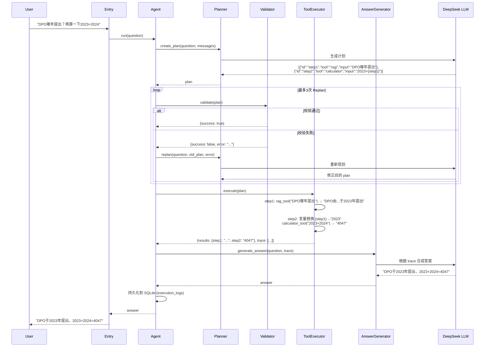

# 🤖 Planner Agent V5

> 基于 DeepSeek LLM 的 **Plan-and-Execute**（规划-执行）智能 Agent 框架  
> 六层解耦架构 · 多工具集成 · 三重入口 · 完整测试覆盖

---

## 📖 项目简介

Planner Agent V5 是一个从零构建的 **规划式 AI Agent**。它将用户复杂问题拆解为有序的 **执行计划**（JSON Plan），依次调用注册工具逐步执行，最后根据执行轨迹生成准确、可追溯的最终答案。

### 核心能力

| 能力 | 说明 |
|------|------|
| 🧠 **智能规划** | LLM 将自然语言问题拆解为多步 JSON 计划，支持变量引用 |
| 🔧 **多工具调用** | 集成 5 种工具：知识检索、安全计算、天气查询、数据库查询、网络搜索 |
| ✅ **计划校验** | 自动校验工具合法性 + 变量依赖，校验失败自动 Replan（最多 3 次）|
| 🔄 **变量引用** | 支持 `{step_id}` 跨步骤引用前序结果 |
| 🔁 **容错重试** | 工具执行失败自动重试（最多 3 次）|
| 💾 **持久化存储** | SQLite 存档每次运行的 (问题, 计划, 轨迹, 答案) |
| 🖥️ **三重入口** | CLI 交互 / FastAPI 服务 / Streamlit 聊天界面 |
| 🐳 **Docker 部署** | 开箱即用的容器化支持 |
| ✅ **完整测试** | 77+ 条 pytest 用例，覆盖全部模块 |

---

## 🏗️ 六层架构

```
┌──────────────────────────────────────────────────────────────┐
│                    1. 入口层 (Entry)                          │
│   main.py (CLI)  │  api.py (FastAPI)  │  app.py (Streamlit)  │
│   职责: 接收用户输入, 创建 Agent, 返回结果                      │
└────────────────────────┬─────────────────────────────────────┘
                         │ 调用 Agent.run(question)
                         ▼
┌──────────────────────────────────────────────────────────────┐
│               2. 编排层 (Orchestration) —— AI 决策大脑          │
│                                                              │
│   agent.py           总调度器, 串联 Plan→Validate→Execute→Answer │
│   planner.py         LLM 生成/重规划 JSON 执行计划              │
│   validator.py       校验工具合法性 + 变量依赖完整性              │
│   answer_generator.py  LLM 根据执行轨迹合成最终答案              │
│                                                              │
│   核心循环: 最多 3 次 Replan, 校验失败则反馈 LLM 重新规划        │
└────────┬───────────────────────────────────┬─────────────────┘
         │ 调度工具                           │ 校验工具合法性
         ▼                                   ▼
┌─────────────────────────┐    ┌─────────────────────────────────┐
│ 3. 工具基础设施层 (core)  │    │     4. 工具实现层 (tools)         │
│                         │    │                                 │
│ tool_registry.py        │    │ calculator_tool.py  AST 安全计算器 │
│   {name → func} 注册表  │    │ weather_tool.py     天气查询 (模拟) │
│                         │    │ rag_tool.py    FAISS + SBERT 检索 │
│ tool_executor.py        │◄───│ db_tool.py          SQLite 历史查询│
│   遍历 Plan, 变量解析,    │    │ web_search_tool.py  Tavily 网络搜索│
│   重试, 生成 trace       │    │                                 │
│                         │    │ 汇总于 tools/__init__.py → TOOLS  │
│ variable_resolver.py    │    │                                 │
│   {step_id} 文本替换     │    │ 职责: 具体工具实现, 供 Agent 调用   │
│                         │    │ 和 Validator 校验               │
│ 职责: 连接 Plan ↔ Tool  │    │                                 │
└────────┬────────────────┘    └──────────────┬──────────────────┘
         │ 执行结果持久化                        │ db_tool 查询历史
         ▼                                    ▼
┌──────────────────────────────────────────────────────────────┐
│               5. 持久层 (Persistence)                         │
│                                                              │
│   db.py               SQLite 连接 + execution_logs 建表        │
│   log_repository.py   仓库模式 CRUD                            │
│   agent.db            运行时数据库文件                          │
│                                                              │
│   职责: 每次运行的 (问题, 计划, 轨迹, 答案) 持久化存档           │
└──────────────────────────────────────────────────────────────┘
         ▲
         │ 全局日志
┌────────┴─────────────────────────────────────────────────────┐
│               6. 基础设施层 (Infrastructure)                   │
│                                                              │
│   logger.py   全局日志 (文件 + 控制台双输出)                     │
│                                                              │
│   职责: 跨模块共享的基础组件 (无业务逻辑)                         │
└──────────────────────────────────────────────────────────────┘
```

### 依赖规则

```
entry ──────► orchestration ──────► core
  │                │                  │
  │                ├──────────────────┤
  │                │                  │
  │                ▼                  ▼
  │            tools ◄────── infrastructure
  │              │
  │              ├──► persistence
  │              │
  └──────────────┴── (无直接依赖)
```

- **entry** → orchestration（创建 Agent 实例）
- **orchestration** → core + tools + persistence + infrastructure（编排所有组件）
- **core** → infrastructure（日志）
- **tools** → persistence（db_tool 查询历史）
- **persistence** → 无项目内依赖（仅标准库 `sqlite3`）
- **infrastructure** → 无项目内依赖（仅标准库 `logging`）

---

## 🔄 核心执行流程

以问题 `"DPO 哪年提出？再算一下 2023+2024 等于几"` 为例：



### 关键设计点

| 机制 | 说明 |
|------|------|
| **Plan → Validate → Replan** | 校验失败时把错误信息反馈给 LLM 重新规划，最多 3 次 |
| **变量解析** | `{step_id}` 语法引用前序步骤输出，执行时动态替换 |
| **Retry** | 每个工具执行失败后自动重试最多 3 次 |
| **Trace 追踪** | 完整记录每步的 (工具, 输入, 输出, 成功/失败, 错误)，可审计 |
| **多轮对话** | messages 列表保存最近 6 条对话历史，支持上下文追问 |

---

## 🛠️ 工具清单

| 工具 | 模块 | 功能 | 实现方式 |
|------|------|------|----------|
| 🔍 **rag** | `tools/rag_tool.py` | 知识库检索 | SentenceTransformer + FAISS 向量相似度搜索 |
| 🧮 **calculator** | `tools/calculator_tool.py` | 安全数学计算 | AST 白名单解析，防止代码注入 |
| 🌤️ **weather** | `tools/weather_tool.py` | 天气查询 | 模拟桩（可替换为真实 API）|
| 🗄️ **db** | `tools/db_tool.py` | 历史记录查询 | SQLite SELECT（只读，查询 execution_logs）|
| 🌐 **web_search** | `tools/web_search_tool.py` | 互联网实时搜索 | Tavily Search API |

### 添加新工具

```
① 在 tools/ 下新建 your_tool.py → 实现 your_tool(input: str) -> str
② 在 tools/__init__.py 中注册: TOOLS["your_tool"] = your_tool
③ 在 orchestration/planner.py 的 get_system_prompt() 中添加工具描述
```

> Agent 和 Validator 共用 ToolRegistry，`_register_tools()` 自动遍历 TOOLS，
> `Validator` 通过 `registry.has()` 校验。新增工具只需改 `tools/__init__.py` 一处。

---

## 📂 项目结构

```
planner_agent_V5/
├── entry/                          # 1. 入口层
│   ├── main.py                     #   CLI 交互式对话
│   ├── api.py                      #   FastAPI REST 服务
│   └── app.py                      #   Streamlit 聊天 UI
│
├── orchestration/                  # 2. 编排层 —— AI 决策大脑
│   ├── agent.py                    #   总调度器 (Plan→Validate→Execute→Answer)
│   ├── planner.py                  #   LLM 计划生成 + 重规划
│   ├── validator.py                #   计划校验 (工具 + 变量依赖)
│   └── answer_generator.py         #   LLM 最终答案生成
│
├── core/                           # 3. 工具基础设施层
│   ├── tool_registry.py            #   工具注册表 {name → function}
│   ├── tool_executor.py            #   计划执行引擎 (变量解析 + 重试)
│   └── variable_resolver.py        #   {step_id} 变量替换
│
├── tools/                          # 4. 工具实现层
│   ├── __init__.py                 #   工具汇总 → TOOLS 字典
│   ├── calculator_tool.py          #   AST 安全计算器
│   ├── weather_tool.py             #   天气查询 (模拟桩)
│   ├── rag_tool.py                 #   FAISS + SentenceTransformer 检索
│   ├── db_tool.py                  #   SQLite 历史查询
│   ├── web_search_tool.py          #   Tavily 网络搜索
│   ├── chunks.pkl                  #   RAG 文本块缓存
│   └── knowledge.index             #   FAISS 向量索引
│
├── persistence/                    # 5. 持久层
│   ├── db.py                       #   SQLite 连接 + 建表
│   ├── log_repository.py           #   仓库模式 CRUD
│   └── agent.db                    #   运行时数据库
│
├── infrastructure/                 # 6. 基础设施层
│   └── logger.py                   #   全局日志配置
│
├── tests/                          # 测试套件 (77+ 用例)
│   ├── conftest.py                 #   共享 Fixtures (Mock LLM, 临时 DB...)
│   ├── core/
│   │   ├── test_tool_registry.py   #   6 tests
│   │   ├── test_tool_executor.py   #   9 tests
│   │   └── test_variable_resolver.py # 9 tests
│   ├── orchestration/
│   │   ├── test_agent.py           #   5 tests
│   │   ├── test_planner.py         #   8 tests
│   │   ├── test_validator.py       #   12 tests
│   │   └── test_answer_generator.py #  5 tests
│   ├── tools/
│   │   ├── test_calculator_tool.py #   9 tests
│   │   ├── test_weather_tool.py    #   4 tests
│   │   ├── test_web_search_tool.py #   4 tests
│   │   └── test_db_tool.py         #   4 tests
│   └── persistence/
│       └── test_log_repository.py  #   6 tests
│
├── config.py                       # 全局配置 (API Key, 路径, 端口)
├── requirements.txt                # Python 依赖
├── Dockerfile                      # Docker 构建文件
├── .dockerignore                   # Docker 忽略规则
├── pyrightconfig.json              # Pyright 类型检查配置
└── README.md                       # 本文件
```

---

## 🚀 快速开始

### 环境要求

- Python 3.11+
- DeepSeek API Key（从 [platform.deepseek.com](https://platform.deepseek.com) 获取）

### 1. 安装依赖

```bash
cd Planner_Agent_From_Scratch/planner_agent_V5
pip install -r requirements.txt
```

### 2. 配置 API Key

在项目父目录 `Planner_Agent_From_Scratch/` 下创建 `.env` 文件：

```env
DEEPSEEK_API_KEY=sk-your-deepseek-api-key
TAVILY_API_KEY=tvly-your-tavily-api-key    # 可选，仅 web_search 工具需要
```

### 3. 运行

三种运行方式任选其一：

```bash
# 方式一: CLI 命令行交互
python -m entry.main

# 方式二: FastAPI 服务 (供外部调用)
uvicorn entry.api:app --host 127.0.0.1 --port 8000

# 方式三: Streamlit Web 聊天界面 (需先启动 FastAPI)
streamlit run entry/app.py
```

### 4. Docker 部署

```bash
docker build -t planner-agent .
docker run -p 8000:8000 --env-file ../.env planner-agent
```

---

## 🧪 运行测试

```bash
cd Planner_Agent_From_Scratch/planner_agent_V5

# 运行全部测试
pytest tests/ -v

# 运行特定模块测试
pytest tests/core/ -v
pytest tests/orchestration/ -v
pytest tests/tools/ -v

# 带覆盖率报告
pytest tests/ -v --cov=. --cov-report=term-missing
```

测试使用 **Mock LLM Client**，无需真实 API 调用，可离线运行。

---

## 📊 效果演示

### CLI 交互

```
用户：DPO哪年提出？再算一下2023+2024等于几
AI：DPO（Direct Preference Optimization）由Rafael Rafailov等人于2023年提出。
    2023 + 2024 = 4047。

用户：它的作者是谁？
AI：DPO的作者是Rafael Rafailov等人（包括Archit Sharma、Eric Mitchell等）。
```

### Streamlit 界面

```
┌─────────────────────────────────────────────┐
│  🤖 Planner Agent Demo                      │
│                                             │
│  ┌─────────────────────────────────────┐    │
│  │ 控制面板                             │    │
│  │ [清空对话]                           │    │
│  │ 当前消息数：4                        │    │
│  └─────────────────────────────────────┘    │
│                                             │
│  ┌─────────────────────────────────────┐    │
│  │ 👤 用户                              │    │
│  │ DPO哪年提出？                        │    │
│  └─────────────────────────────────────┘    │
│  ┌─────────────────────────────────────┐    │
│  │ 🤖 助手                              │    │
│  │ DPO于2023年由Rafael Rafailov等人     │    │
│  │ 提出...                              │    │
│  └─────────────────────────────────────┘    │
│                                             │
│  ┌─────────────────────────────────────┐    │
│  │ 📝 请输入问题...           [发送]    │    │
│  └─────────────────────────────────────┘    │
└─────────────────────────────────────────────┘
```

### 内部执行过程（日志示例）

```
2026-06-26 20:30:00 | INFO | Execute Tool: rag
2026-06-26 20:30:01 | INFO | Tool Success: rag
2026-06-26 20:30:01 | INFO | Execute Tool: calculator
2026-06-26 20:30:02 | INFO | LLM Output:
[{"id":"step1","tool":"rag","input":"DPO哪年提出"},
 {"id":"step2","tool":"calculator","input":"2023+{step1}"}]
```

### SQLite 持久化记录

```sql
SELECT id, question, substr(answer, 1, 50) FROM execution_logs;

 id | question                              | answer
----+---------------------------------------+--------------------------------------------------
 1  | DPO哪年提出？再算一下2023+2024等于几   | DPO于2023年提出，2023+2024=4047
 2  | 它的作者是谁？                         | DPO由Rafael Rafailov等人提出...
 3  | 北京天气怎么样？                       | 北京天气晴朗 30℃
```

---

## 🔧 技术栈

| 层级 | 技术 | 用途 |
|------|------|------|
| LLM | DeepSeek API (`deepseek-chat`) | 规划生成 + 答案合成 |
| 嵌入 | SentenceTransformer (`paraphrase-multilingual-MiniLM-L12-v2`) | 文本向量化 (384维) |
| 向量检索 | FAISS | 语义相似度搜索 |
| Web 框架 | FastAPI + Uvicorn | REST API 服务 |
| UI | Streamlit | 聊天界面 |
| 数据库 | SQLite | 执行历史持久化 |
| HTTP | requests | Streamlit ↔ FastAPI 通信 |
| 网络搜索 | Tavily API | 互联网实时搜索 |
| 测试 | pytest + unittest.mock | 单元测试 |
| 容器 | Docker | 容器化部署 |
| 类型检查 | Pyright | 静态类型分析 |

---

## 🎯 设计理念

### 1. Plan-and-Execute 优于 ReAct

传统的 ReAct Agent 在每一步都需要 LLM 决策 "下一步做什么"，导致：
- 延迟高（串行 LLM 调用）
- 上下文膨胀（每次都要传完整对话历史）
- 缺乏全局视角

Plan-and-Execute 将规划和执行分离，LLM 一次性生成完整计划，然后由确定性引擎执行，效率更高、可审计。

### 2. 六层解耦

每一层仅依赖下层，职责清晰：
- 修改工具实现不影响编排逻辑
- 替换 LLM 提供商只需修改 config.py
- 添加新入口不影响核心 Agent

### 3. 防御性设计

- **Plan 校验**: 在执行前拦截非法工具和无效变量引用
- **Replan 循环**: 校验失败不是 fatal error，而是反馈给 LLM 修正
- **AST 安全计算器**: 白名单操作符，拒绝任意代码执行
- **工具执行重试**: 瞬态故障自动恢复

---

## 📝 License

MIT License

---

## 👤 作者

罗思源 (Luo Siyuan)

---

*V5 是从 V0-V4 逐步迭代而来，代表了从原型到工程化的完整演进过程。*
