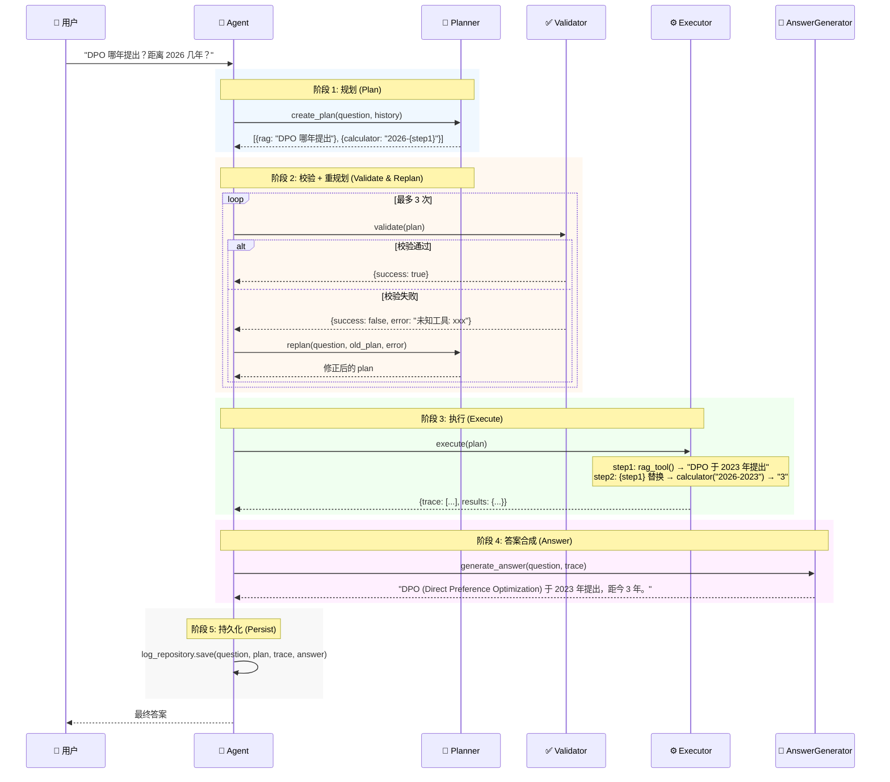

# PlanAgent V6

> 基于 DeepSeek LLM 的 Plan-and-Execute 智能 Agent 框架 —— 将自然语言问题拆解为多步 JSON 执行计划，调度工具链逐步执行，根据完整执行轨迹合成可追溯的最终答案。

[](https://www.python.org/)
[](https://fastapi.tiangolo.com/)
[](https://streamlit.io/)
[](https://deepseek.com/)
[](LICENSE)

---

## 目录

- [核心能力](#核心能力)
- [快速开始](#快速开始)
- [架构设计](#架构设计)
- [执行流程](#执行流程)
- [项目结构](#项目结构)
- [配置说明](#配置说明)
- [五工具详解](#五工具详解)
- [入口选择](#入口选择)
- [API 文档](#api-文档)
- [Docker 部署](#docker-部署)
- [测试](#测试)
- [技术栈](#技术栈)
- [界面截图](#界面截图)
- [开发指南](#开发指南)
- [常见问题](#常见问题)
- [License](#license)

---

## 核心能力

| 能力 | 说明 |
|------|------|
| 🧠 **多步骤规划** | LLM 拆解复杂问题为有序 JSON 计划，步骤间通过 `{step_id}` 声明显式依赖，执行引擎按序解析并注入上游结果 |
| 🛡️ **三层校验** | `response_format` API 强制 → JSON Schema 机械验证 → 业务规则校验，任一失败自动触发 Replan（最多 3 次） |
| 🔧 **五工具集成** | RAG 向量检索 / AST 安全计算器 / Tavily 网络搜索 / SQLite 历史查询 / 天气查询，ToolRegistry 统一管理 |
| 🔄 **双层容错** | 工具执行级：失败自动重试 3 次；计划级：校验失败反馈 LLM 重新规划，最多 3 次 |
| 📊 **全链路可观测** | 结构化日志按轮次分段记录计划、轨迹、答案，每步标注成功/失败状态；SQLite 自动建库建表，完整归档每次运行 |
| 🐳 **工程化** | 六层解耦架构，全量测试 Mock LLM 离线可跑，Docker 一键启动，浏览器侧边栏运行时注入密钥 |

---

## 快速开始

### 方式一：Docker（推荐）

无需安装 Python 环境，一键启动：

```bash
git clone <repo-url> && cd Planner_Agent_From_Scratch
docker-compose up -d
```

打开 `http://localhost:8501`，在侧边栏粘贴 DeepSeek API Key，点击**保存配置**即可对话。无需编辑任何配置文件。

### 方式二：本地运行

**环境要求：** Python 3.11+

```bash
cd planner_agent_V6

# 1. 安装依赖
pip install -r requirements.txt

# 2. 配置 API Key
cp .env.example .env
# 编辑 .env，填入 DEEPSEEK_API_KEY 和 TAVILY_API_KEY（可选）

# 3. 选择入口启动
python -m entry.main                              # CLI 命令行
uvicorn entry.api:app --host 0.0.0.0 --port 8000  # HTTP API
streamlit run entry/app.py                         # Web 聊天界面
```

---

## 架构设计

PlanAgent 采用 **六层解耦架构**，每层职责清晰、可独立测试：

```mermaid
flowchart TB
    subgraph Entry["🎯 入口层 — Entry"]
        CLI["main.py (CLI 交互)"]
        API["api.py (FastAPI HTTP)"]
        Web["app.py (Streamlit Web)"]
    end

    subgraph Orch["🧠 编排层 — Orchestration"]
        Agent["Agent — 总调度器"]
        Planner["Planner — LLM 计划生成 + 重规划"]
        Validator["Validator — 工具合法性 + 依赖校验"]
        Answer["AnswerGenerator — 轨迹合成最终答案"]
    end

    subgraph Core["⚙️ 工具基础设施 — Core"]
        Registry["ToolRegistry — name → func 注册表"]
        Executor["ToolExecutor — 遍历计划, 变量解析, 重试"]
        Resolver["VariableResolver — {step_id} 文本替换"]
    end

    subgraph Tools["🔧 工具实现 — Tools"]
        RAG["rag — FAISS + SBERT 向量检索"]
        Calc["calculator — AST 安全计算器"]
        Search["web_search — Tavily 网络搜索"]
        DB["db — SQLite 历史查询"]
        Weather["weather — 天气查询"]
    end

    subgraph Persist["💾 持久化层 — Persistence"]
        Repo["LogRepository — 仓库模式 CRUD"]
        SQLite[("agent.db — execution_logs 表")]
    end

    subgraph Infra["🏗️ 基础设施 — Infrastructure"]
        Logger["Logger — 结构化日志 + 噪音压制"]
    end

    Entry --> Agent
    Agent --> Planner
    Agent --> Validator
    Agent --> Answer
    Agent --> Executor
    Validator -.->|has()| Registry
    Executor --> Registry
    Executor --> Resolver
    Executor --> Tools
    DB --> Repo
    Repo --> SQLite
    Infra -.-> Agent
```

### 各层职责

| 层级 | 目录 | 职责 |
|------|------|------|
| **入口层** | `entry/` | 提供 CLI、HTTP API、Streamlit Web 三种交互方式 |
| **编排层** | `orchestration/` | 计划生成、校验、执行、答案合成的完整生命周期管理 |
| **工具基础设施** | `core/` | 工具注册、执行引擎、变量解析的通用抽象 |
| **工具实现** | `tools/` | 具体工具函数，每个都是接收字符串返回字符串的纯函数 |
| **持久化层** | `persistence/` | SQLite 数据库连接与会话归档 |
| **基础设施** | `infrastructure/` | 日志系统与历史遗留代码 |

---

## 执行流程

一次完整的问答经过 **5 个阶段**，完整时序如下：



### 关键设计决策

1. **变量引用机制**：步骤间通过 `{step_id}` 语法传递数据。解析发生在执行时而非规划时，使 LLM 能在不知道具体值的情况下表达依赖关系。
2. **三层解析策略**：直接 JSON 解析 → 正则回退（处理 markdown 包裹）→ JSON Schema 验证，确保 LLM 输出格式偏差时仍能容错。
3. **失败不中断**：单个工具步骤失败不会终止整个执行流程，AnswerGenerator 能看到所有步骤的状态（含错误信息），确保最终答案的完整性。
4. **运行时密钥注入**：API Key 通过 `/configure` 端点或 Streamlit 侧边栏传入，Docker 部署无需编辑配置文件。

---

## 项目结构

```
planner_agent_V6/
│
├── entry/                              # 🎯 入口层
│   ├── __init__.py
│   ├── main.py                         #   CLI 交互循环
│   ├── api.py                          #   FastAPI 后端 (/chat, /configure, /health)
│   └── app.py                          #   Streamlit 聊天界面
│
├── orchestration/                      # 🧠 编排层
│   ├── __init__.py
│   ├── agent.py                        #   总调度器 — 生命周期管理
│   ├── planner.py                      #   LLM 计划生成 + 重规划 + 三层解析
│   ├── validator.py                    #   工具合法性 + {step_id} 依赖校验
│   ├── answer_generator.py             #   基于执行轨迹的答案合成
│   └── schema.py                       #   JSON Schema 定义 (PLAN_SCHEMA)
│
├── core/                               # ⚙️ 工具基础设施
│   ├── __init__.py
│   ├── tool_registry.py                #   工具注册表 {name → callable}
│   ├── tool_executor.py                #   执行引擎 (变量解析 + 重试 + 轨迹记录)
│   └── variable_resolver.py            #   {step_id} → 上游结果文本替换
│
├── tools/                              # 🔧 工具实现
│   ├── __init__.py                     #   TOOLS 字典 — 新增工具仅需在此注册
│   ├── calculator_tool.py              #   AST 安全计算器 (防代码注入)
│   ├── weather_tool.py                 #   天气查询
│   ├── rag_tool.py                      #   FAISS + SentenceTransformer 向量检索
│   ├── db_tool.py                      #   SQLite 历史查询
│   ├── web_search_tool.py              #   Tavily 网络搜索
│   ├── knowledge.index                 #   FAISS 向量索引文件
│   └── chunks.pkl                      #   RAG 文本块 (pickle)
│
├── persistence/                        # 💾 持久化
│   ├── __init__.py
│   ├── db.py                           #   SQLite 连接 + 自动建表
│   └── log_repository.py               #   仓库模式 CRUD
│
├── infrastructure/                     # 🏗️ 基础设施
│   ├── __init__.py
│   └── logger.py                       #   结构化日志 + 噪音库压制
│
├── frontend/                           # 🐳 独立前端 Docker 镜像
│   ├── Dockerfile                      #   Streamlit 容器
│   ├── app.py                          #   前端代码 (连接远程 API)
│   └── requirements.txt
│
├── tests/                              # 🧪 测试套件
│   ├── __init__.py
│   ├── conftest.py                     #   共享 Mock 夹具
│   ├── core/                           #   测试工具基础设施
│   │   ├── test_tool_registry.py
│   │   ├── test_tool_executor.py
│   │   └── test_variable_resolver.py
│   ├── orchestration/                  #   测试编排层
│   │   ├── test_agent.py
│   │   ├── test_planner.py
│   │   ├── test_validator.py
│   │   └── test_answer_generator.py
│   ├── persistence/                    #   测试持久化层
│   │   └── test_log_repository.py
│   └── tools/                          #   测试各工具
│       ├── test_calculator_tool.py
│       ├── test_weather_tool.py
│       ├── test_db_tool.py
│       └── test_web_search_tool.py
│
├── .env.example                        # 环境变量模板
├── .dockerignore
├── Dockerfile                          # API 镜像
├── config.py                           # 全局配置
├── requirements.txt                    # Python 依赖
└── README.md                           # 本文档
```

---

## 配置说明

所有配置集中在 `config.py`，通过 `.env` 文件注入敏感信息：

### 环境变量 (`.env`)

```bash
# 必填：DeepSeek API Key
DEEPSEEK_API_KEY=sk-xxxxxxxxxxxxxxxxxxxxxxxxxxxxxxxx

# 可选：Tavily 搜索 API Key（不填则 web_search 工具不可用）
TAVILY_API_KEY=tvly-xxxxxxxxxxxxxxxxxxxxxxxxxxxxxxxx
```

### 可配置项 (`config.py`)

| 配置项 | 默认值 | 说明 |
|--------|--------|------|
| `LLM_MODEL` | `deepseek-chat` | DeepSeek 模型名称 |
| `DEEPSEEK_BASE_URL` | `https://api.deepseek.com` | API 端点 |
| `DATABASE_PATH` | `persistence/agent.db` | SQLite 数据库路径 |
| `LOG_PATH` | `logs/agent.log` | 日志文件路径 |
| `RAG_INDEX_PATH` | `tools/knowledge.index` | FAISS 索引文件 |
| `RAG_CHUNK_PATH` | `tools/chunks.pkl` | RAG 文本块文件 |
| `HOST` / `PORT` | `127.0.0.1:8000` | FastAPI 监听地址 |
| `DEBUG` | `True` | 是否输出 DEBUG 级别日志 |

---

## 五工具详解

### 1. RAG 向量检索 (`rag`)

基于 FAISS + SentenceTransformer 的本地知识库检索。

- **模型：** `paraphrase-multilingual-MiniLM-L12-v2`（384 维，中英文支持）
- **索引：** FAISS `IndexFlatL2` 精确搜索
- **返回：** Top-3 最相关文本块
- **适用场景：** 需要从本地文档中检索知识的问题

### 2. AST 安全计算器 (`calculator`)

通过 Python AST 白名单解析，杜绝代码注入。

- **原理：** 使用 `ast.parse(mode='eval')` 解析表达式，仅允许 `Constant` 和 `BinOp` 节点
- **防护：** 阻断所有函数调用、属性访问、导入语句
- **清洗：** 内置自然语言文本清洗器，自动提取数学表达式
- **示例：** `calculator("2026 - 2023")` → `"3"`

### 3. Tavily 网络搜索 (`web_search`)

调用 Tavily Search API 进行实时网络搜索。

- **搜索深度：** `basic`
- **返回：** 最多 5 条搜索结果的内容摘要
- **依赖：** 需要配置 `TAVILY_API_KEY`
- **适用场景：** 需要最新信息或事实核查的问题

### 4. SQLite 历史查询 (`db`)

查询过往会话记录。

- **原理：** 封装 `LogRepository.execute_query()`，执行原生 `SELECT` 语句
- **安全：** 仅支持 SELECT，异常捕获为字符串而非向外传播
- **示例：** `db("SELECT question, answer FROM execution_logs LIMIT 5")`

### 5. 天气查询 (`weather`)

演示用简单工具，返回固定格式的天气信息。

- **输入：** 城市名称
- **输出：** `"{city}天气晴朗 30℃"`
- **用途：** 演示工具注册和调用机制

### 扩展新工具

新增工具只需 **三步**：

1. 在 `tools/` 下创建 `xxx_tool.py`，实现 `xxx_tool(input_str: str) -> str`
2. 在 `tools/__init__.py` 的 `TOOLS` 字典中添加 `"xxx": xxx_tool`
3. 在 `orchestration/planner.py` 的 `get_system_prompt()` 中添加工具描述

无需修改 `Agent`、`Validator` 或 `ToolExecutor` 的任何代码。

---

## 入口选择

PlanAgent 提供三种使用方式，根据不同场景选择：

### CLI 命令行 (`entry/main.py`)

```bash
python -m entry.main
```

- 适合快速测试和开发调试
- 交互式循环，输入问题立即获得答案
- 日志实时输出到控制台

### HTTP API (`entry/api.py`)

```bash
uvicorn entry.api:app --host 0.0.0.0 --port 8000
```

- 适合作为后端服务集成到其他应用
- 提供 Swagger 文档（`/docs`）
- 支持运行时密钥注入

### Streamlit Web (`entry/app.py`)

```bash
streamlit run entry/app.py
```

- 适合演示和日常使用
- 聊天式界面，支持对话历史
- 侧边栏配置 API Key，无需编辑文件

---

## API 文档

启动 FastAPI 服务后，访问 `http://localhost:8000/docs` 查看 Swagger 交互文档。

### 端点列表

| 方法 | 路径 | 说明 |
|------|------|------|
| `GET` | `/health` | 健康检查，返回 `{"status": "ok"}` |
| `POST` | `/configure` | 运行时注入 API Key |
| `POST` | `/chat` | 发送问题并获取答案 |

### `/configure` — 配置 API Key

```json
{
  "deepseek_api_key": "sk-xxxxxxxxxxxxxxxxxxxxxxxxxxxxxxxx",
  "tavily_api_key": "tvly-xxxxxxxxxxxxxxxxxxxxxxxxxxxxxxxx"
}
```

> 注意：此接口需在首次调用 `/chat` 之前调用，否则 Agent 尚未初始化。

### `/chat` — 发送问题

**请求：**
```json
{
  "query": "DPO 算法是哪一年提出的？距离 2026 年有多少年？"
}
```

**响应：**
```json
{
  "answer": "DPO (Direct Preference Optimization) 算法于 2023 年由 Rafael Rafailov 等人提出，距离 2026 年有 3 年。",
  "plan": [
    {"id": "step1", "tool": "rag", "input": "DPO 算法提出的年份"},
    {"id": "step2", "tool": "calculator", "input": "2026 - {step1}"}
  ]
}
```

---

## Docker 部署

项目支持前后端分离的 Docker 部署：

### 架构

```
┌─────────────────┐     ┌─────────────────┐
│  Streamlit 前端  │────▶│  FastAPI 后端   │
│  (port 8501)    │     │  (port 8000)    │
│  frontend/      │     │  planner_agent/ │
└─────────────────┘     └─────────────────┘
                               │
                               ▼
                        ┌─────────────────┐
                        │  DeepSeek API   │
                        └─────────────────┘
```

### 启动命令

```bash
# 使用 docker-compose（推荐）
docker-compose up -d

# 或手动构建
docker build -t planner-agent-api .
docker run -d -p 8000:8000 planner-agent-api

cd frontend
docker build -t planner-agent-web .
docker run -d -p 8501:8501 -e BACKEND_URL=http://localhost:8000 planner-agent-web
```

### 使用方式

1. 浏览器打开 `http://localhost:8501`
2. 在左侧边栏输入 DeepSeek API Key
3. （可选）输入 Tavily API Key 以启用联网搜索
4. 点击**保存配置**
5. 在聊天框输入问题开始对话

---

## 测试

```bash
cd planner_agent_V6
pytest tests/ -v
```

### 测试统计

| 模块 | 测试文件数 | 覆盖内容 |
|------|-----------|---------|
| `core/` | 3 | ToolRegistry、ToolExecutor、VariableResolver |
| `orchestration/` | 4 | Agent 全生命周期、Planner 三层解析、Validator 校验、AnswerGenerator |
| `tools/` | 4 | Calculator 安全防护、Weather、DB、WebSearch |
| `persistence/` | 1 | LogRepository CRUD |

### 测试特点

- **全 Mock LLM**：无需 API Key 和网络连接，完全离线可跑
- **夹具复用**：`conftest.py` 提供共享 Mock 对象
- **边界覆盖**：包含空输入、错误格式、中文编码、注入攻击等边界用例

---

## 技术栈

| 层级 | 技术选型 | 说明 |
|------|---------|------|
| LLM | DeepSeek API + `response_format` | 强制 JSON 结构化输出 |
| 校验 | JSON Schema (`jsonschema`) + 业务规则 | 双层保障计划正确性 |
| 向量检索 | SentenceTransformer + FAISS IndexFlatL2 | 384 维多语言向量精确搜索 |
| 计算器 | Python AST 白名单 + 自然语言清洗 | 安全计算，杜绝注入 |
| 网络搜索 | Tavily Search API | 实时搜索结果 |
| 存储 | SQLite | 轻量级会话归档 |
| 后端 | FastAPI + Uvicorn | 高性能异步 HTTP |
| 前端 | Streamlit | 快速构建聊天界面 |
| 测试 | pytest + unittest.mock | 全 Mock 离线测试 |
| 部署 | Docker + docker-compose | 一键启动 |

---

## 界面截图

### Streamlit 前端界面

> 完整的聊天交互界面，左侧 API Key 配置面板，右侧对话区域支持多轮上下文理解。


### 执行日志输出

> 结构化日志记录：每轮的计划（Plan）、各步骤执行轨迹（Trace）、最终答案（Answer），成功/失败状态一目了然。


### SQLite 持久化存储

> 每次问答的完整记录（问题、计划、轨迹、答案）自动归档到 `persistence/agent.db`，支持历史查询与回溯。


---

## 开发指南

### 添加新工具

```python
# 1. tools/xxx_tool.py
def xxx_tool(input_str: str) -> str:
    """工具逻辑，接收字符串返回字符串"""
    # 实现你的逻辑
    return result

# 2. tools/__init__.py — 在 TOOLS 字典中添加
from tools.xxx_tool import xxx_tool
TOOLS = {
    # ... 现有工具
    "xxx": xxx_tool,
}

# 3. orchestration/planner.py — 在 get_system_prompt() 中添加工具描述
# 让 LLM 知道这个工具的存在、用途和输入格式
```

### 调试技巧

- 设置 `DEBUG=True`（`config.py`）启用详细日志
- 查看 `logs/agent.log` 查看完整的执行轨迹
- 使用 CLI 入口 (`python -m entry.main`) 进行快速迭代
- Swagger UI (`/docs`) 可用于单独测试 API 端点

### 代码规范

- 工具函数签名统一为 `(input_str: str) -> str`
- 工具异常应在函数内部捕获并返回错误字符串
- 新增工具需同步编写测试文件
- 编排逻辑变更需更新 `tests/conftest.py` 中的 Mock

---

## 常见问题

### Q: 为什么策划失败？

可能的原因：
1. **API Key 无效** — 检查 DeepSeek API Key 是否正确
2. **网络问题** — 确认能否访问 `https://api.deepseek.com`
3. **问题过于复杂** — 尝试拆分问题为更简单的子问题
4. **规划超时** — 检查 `agent.py` 中的 `max_attempts` 设置

### Q: 工具执行失败怎么办？

每个工具都有内置的 3 次重试机制。如果全部失败，该步骤的失败信息会被传递给 AnswerGenerator，确保最终答案仍然能生成。不会因为单个步骤失败而中断整个流程。

### Q: 如何查看历史记录？

所有问答记录保存在 `persistence/agent.db` 的 `execution_logs` 表中：

```sql
-- 查看最近 10 条记录
SELECT id, question, answer FROM execution_logs ORDER BY id DESC LIMIT 10;

-- 查看特定问题的完整轨迹
SELECT trace FROM execution_logs WHERE question LIKE '%DPO%';
```

也可以使用 Agent 自带的 `db` 工具在对话中查询。

### Q: RAG 知识库如何更新？

替换 `tools/chunks.pkl` 和 `tools/knowledge.index` 文件即可。新的索引需要使用相同的 SentenceTransformer 模型生成（`paraphrase-multilingual-MiniLM-L12-v2`，384 维）。

### Q: 支持其他 LLM 吗？

理论上支持任何 OpenAI 兼容 API，在 `config.py` 中修改 `DEEPSEEK_BASE_URL` 和 `LLM_MODEL` 即可。但 Planner 的提示词针对 DeepSeek 的 `response_format` 优化，切换模型可能需要调优。

---

## License

MIT © PlanAgent

---

<p align="center">
  <sub>Built with ❤️ using DeepSeek · FastAPI · Streamlit · FAISS</sub>
</p>